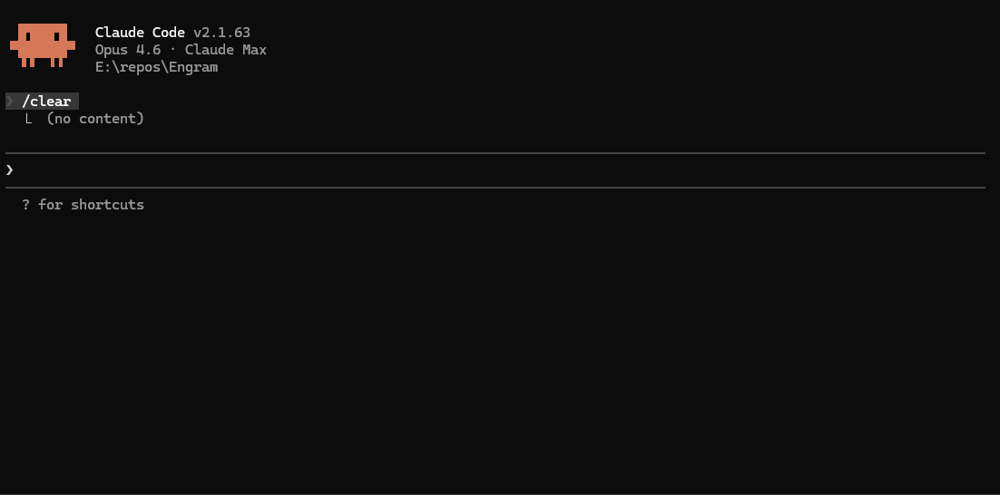

# Engram

GPU-accelerated local semantic code index for Claude Code. Embeds your codebase using CUDA-optimized inference, maintains a live vector index with incremental updates, and serves precise context via MCP tools. Replaces brute-force file reads with intelligent retrieval.

<p align="center">
  
</p>

## Why

Claude Code reads entire files to find relevant context — a function signature here, a type definition there. On a large codebase, this burns through the context window fast.

Engram maintains a persistent semantic index locally. Instead of reading 10 files to find the 3 functions that matter, Claude Code queries Engram and gets back precisely the relevant snippets — with file paths, line numbers, and similarity scores. Sub-3ms per query, fully on your GPU.

## Features

- **Semantic code search** — ask natural questions ("how is depth fusion implemented"), get ranked code snippets
- **Symbol lookup** — find functions, classes, structs by name across all indexed projects
- **Context retrieval** — given a file and line, pull related code from across the codebase
- **Session memory** — persists key decisions across Claude Code sessions for continuity
- **Multi-project** — single process indexes multiple codebases, results merged by relevance
- **Incremental updates** — file watcher detects changes, re-indexes only what changed (content hashing)
- **AST-aware chunking** — tree-sitter parses 9 languages into precise semantic units (functions, classes, methods)
- **GPU-accelerated** — ONNX Runtime + CUDA embedding, batch inference, sub-3ms queries

## How It Works

```
┌──────────────┐     ┌──────────────┐     ┌──────────────┐
│  File Watcher │────>│   Chunker    │────>│  Embedder    │
│  (filesystem) │     │  (tree-sitter│     │  (ONNX+CUDA) │
└──────────────┘     │   or regex)  │     └──────┬───────┘
                     └──────────────┘            │
                                                 v
┌──────────────┐     ┌──────────────┐     ┌──────────────┐
│  Claude Code │<────│  MCP Server  │<────│ Vector Index │
│  (queries)   │     │  (stdio)     │     │  (HNSW)      │
└──────────────┘     └──────────────┘     └──────────────┘
```

1. **File watcher** monitors your project for changes (new files, edits, deletions)
2. **Chunker** splits code into semantic units using tree-sitter AST parsing (or regex fallback)
3. **Embedder** runs all-MiniLM-L6-v2 on your GPU via ONNX Runtime + CUDA
4. **Vector index** stores embeddings in an HNSW graph for fast approximate nearest-neighbor search
5. **MCP server** exposes tools over stdio — Claude Code queries naturally

## MCP Tools

| Tool | Description |
|------|-------------|
| `search_code` | Semantic search: "how is depth fusion implemented" → ranked snippets |
| `search_symbol` | Find by symbol name: function, class, struct |
| `get_context` | Given a file and line range, retrieve related code across the project |
| `get_session_memory` | Retrieve summaries from previous coding sessions |
| `save_session_summary` | Persist key decisions/changes from current session |

## Requirements

- Windows 10/11 (Linux support planned for v2.0)
- CMake 3.24+, Visual Studio 2022 (MSVC)
- NVIDIA GPU with CUDA 12.x + cuDNN 9.x (for GPU embedding; core features work without GPU)
- ONNX Runtime 1.24+ GPU package (optional)
- Claude Code with MCP support

## Tech Stack

| Layer | Technology |
|-------|------------|
| Language | C++17 (MSVC) |
| GPU inference | ONNX Runtime + CUDA Execution Provider |
| Vector index | hnswlib (HNSW, cosine similarity) |
| Code parsing | tree-sitter (9 languages) + regex fallback |
| Protocol | MCP over stdio (JSON-RPC 2.0) |
| Serialization | nlohmann/json |
| Logging | spdlog (stderr) |
| Testing | Google Test (177 tests) |

## Building

```bash
# Core build (no GPU embedding — symbol search and session memory still work)
cmake -B build -G "Visual Studio 17 2022" -A x64
cmake --build build --config Release
cd build && ctest -C Release --output-on-failure

# With tree-sitter for AST-aware chunking (more accurate symbol boundaries)
cmake -B build -G "Visual Studio 17 2022" -A x64 \
  -DENGRAM_USE_TREESITTER=ON
cmake --build build --config Release

# With ONNX Runtime for GPU-accelerated semantic search
cmake -B build -G "Visual Studio 17 2022" -A x64 \
  -DENGRAM_USE_ONNX=ON \
  -DONNXRUNTIME_ROOT="path/to/onnxruntime-win-x64-gpu"
cmake --build build --config Release

# Full build (tree-sitter + ONNX)
cmake -B build -G "Visual Studio 17 2022" -A x64 \
  -DENGRAM_USE_TREESITTER=ON \
  -DENGRAM_USE_ONNX=ON \
  -DONNXRUNTIME_ROOT="path/to/onnxruntime-win-x64-gpu"
cmake --build build --config Release
```

## Model Export

Before running with GPU embedding, export the ONNX model:

```bash
# Create a Python venv (once)
python -m venv .venv
.venv/Scripts/activate  # Windows

# Install dependencies
pip install torch transformers onnx onnxruntime-gpu

# Export all-MiniLM-L6-v2 (384-dim, ~86MB) — recommended for 6GB VRAM GPUs
python scripts/export_model.py --model minilm --output models/ --validate

# Or export with INT8 quantization for smaller size
python scripts/export_model.py --model minilm --output models/ --quantize --validate
```

This writes `models/all-MiniLM-L6-v2.onnx` and `models/tokenizer.json`.

## Usage

```bash
# Run the MCP server directly (for testing)
./build/bin/engram-mcp.exe --project /path/to/your/repo --model models/all-MiniLM-L6-v2.onnx --treesitter

# Register with Claude Code (user scope — available in all projects)
claude mcp add engram --scope user -- \
  /path/to/engram-mcp.exe \
  --project /path/to/your/repo \
  --model /path/to/models/all-MiniLM-L6-v2.onnx

# On restart, engram automatically detects changed files via content hashing
# and only re-indexes what changed. Use --reindex to force a full rebuild:
claude mcp remove engram --scope user
claude mcp add engram --scope user -- \
  /path/to/engram-mcp.exe \
  --project /path/to/your/repo \
  --model /path/to/models/all-MiniLM-L6-v2.onnx \
  --reindex

# Claude Code will automatically discover the tools in a new session.
# The bundled skill teaches Claude when to use engram vs built-in search.
# Just ask naturally: "how is camera calibration implemented?"
```

### Multi-Project Support

A single `engram-mcp` process can index and serve multiple codebases. Each project gets its own independent index, chunk store, and session memory.

```bash
# Index two projects at once
./build/bin/engram-mcp.exe \
  --project /path/to/project-a \
  --project /path/to/project-b \
  --model models/all-MiniLM-L6-v2.onnx

# Or use a config file
./build/bin/engram-mcp.exe --config .engram.toml --model models/all-MiniLM-L6-v2.onnx
```

**`.engram.toml`** (optional config file):

```toml
[[project]]
path = "E:/Repos/Engram"

[[project]]
path = "E:/Repos/OtherProject"
data_dir = "D:/EngData/OtherProject"   # optional override
```

When multiple projects are loaded, search results include a `"project"` field identifying which codebase each result comes from. In single-project mode, this field is omitted for backwards compatibility.

### CLI Options

| Flag | Description |
|------|-------------|
| `--project <path>` | Root of the codebase to index (repeatable for multi-project) |
| `--model <path>` | Path to the ONNX embedding model |
| `--data-dir <path>` | Directory for persistent data (single-project only; default: `<project>/.engram/`) |
| `--config <path>` | Path to `.engram.toml` config file (default: `.engram.toml` in cwd) |
| `--dim <int>` | Embedding dimension (default: 384, auto-detected from model) |
| `--batch-size <int>` | Batch size for GPU embedding (default: 32) |
| `--reindex` | Force a full re-index (default: incremental via content hashing) |
| `--treesitter` | Use tree-sitter AST-aware chunker (requires `ENGRAM_USE_TREESITTER` build) |
| `--verbose` | Enable debug-level logging |

## Performance

Benchmarked on RTX 3060 6GB, CUDA 12.8, indexing the Engram codebase itself (43 source files, ~463 KB).

### Chunking Speed

| Chunker | Time | Chunks | Throughput |
|---------|------|--------|------------|
| Regex | 5,187 ms | 1,182 | 228 chunks/sec |
| Tree-sitter | 196 ms | 619 | 3,162 chunks/sec |
| **Speedup** | **26.5x** | | |

Tree-sitter produces fewer, more precise chunks by using AST structure rather than regex heuristics.

### Cold Indexing Speed

End-to-end time from empty index to fully searchable, including chunking + GPU embedding + index build:

| Phase | Time |
|-------|------|
| Chunking (tree-sitter) | 196 ms |
| Embedding (619 chunks, batch=32) | 2,208 ms |
| Index save | ~25 ms |
| **Total cold start** | **~2.4 s** |

Warm restarts with content-hash checking skip unchanged files. Typical warm restart: 5 ms.

### Query Latency

Per-query time breakdown (embed query + HNSW search, k=10, 20 queries):

| Phase | Mean | Min | Max |
|-------|------|-----|-----|
| Embed query | 2.64 ms | 2.21 ms | 3.56 ms |
| HNSW search | 0.13 ms | 0.08 ms | 0.44 ms |
| **Total** | **2.76 ms** | 2.31 ms | 3.86 ms |

### Memory Footprint

| Component | Size |
|-----------|------|
| HNSW index (on disk / in-memory) | 2.7 MB |
| Chunk metadata (chunks.json) | 820 KB |

### Reproducing

```bash
# Run the full benchmark suite
./build/bin/engram_benchmarks.exe \
  --project . \
  --model models/all-MiniLM-L6-v2.onnx \
  --iterations 3 \
  --batch-size 32 \
  --warmup 3 \
  --queries 20
```

## License

MIT
